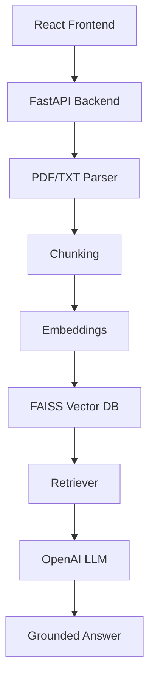

# Context-Aware Document Q&A Bot (RAG)

This is a Retrieval-Augmented Generation chatbot that lets users upload PDF or TXT documents and ask grounded questions about them. The system parses the document, chunks the extracted text, embeds the chunks, searches a FAISS vector index, and sends the best matches to OpenAI for a final answer.

## Overview

The application is designed to answer only from uploaded content. It returns source references, confidence scores, and highlighted retrieved chunks so users can verify where an answer came from.

## Features

- PDF/TXT upload
- Document parsing with page metadata
- Overlapping chunk generation
- Semantic search with embeddings and FAISS
- OpenAI-powered grounded answers
- ChatGPT-style chat UI
- Session conversation history
- Multiple uploaded documents with per-document sessions
- Source references and confidence scores
- Exact paragraph previews for explainability
- Cosine similarity retrieval with normalized embeddings
- Out-of-scope detection using similarity plus lexical overlap

## Architecture



## Tech Stack

Frontend:

- React
- TypeScript
- Axios

Backend:

- FastAPI
- Python

AI / Retrieval:

- Sentence Transformers
- FAISS
- OpenAI API
- PyMuPDF

## Chunking Strategy

The document is split into overlapping word chunks.

- Chunk size: 500 words
- Overlap: 100 words

This helps keep context continuity between neighboring chunks and improves retrieval quality.

## Retrieval Pipeline

1. Parse uploaded PDF or TXT into page-level text with page metadata.
2. Split text into overlapping chunks (500 words, 100-word overlap).
3. Generate embeddings using Sentence Transformers (all-MiniLM-L6-v2).
4. Normalize vectors and store in FAISS IndexFlatIP (cosine similarity).
5. Convert user questions into embeddings.
6. Retrieve top-k chunks using FAISS similarity search.
7. Apply dual-scoring: lexical overlap + semantic similarity.
8. Classify scope (in-scope/out-of-scope) using thresholds.
9. Send top retrieved context + matched paragraph to OpenAI.
10. Return grounded answer with sources, confidence, and scope info.

## API Endpoints

- `POST /upload` - upload PDF/TXT, parse it, chunk it, embed it, and index it
- `POST /ask` - ask a question about the uploaded document

## Environment Variables

Create `backend/.env` from `backend/.env.example` and set:

```env
OPENAI_API_KEY=your_api_key_here
Context-Aware Document Q&A Bot

Minimal submission README — quick usage

- Run backend (from repository root):

  python -m uvicorn backend.app:app --host 0.0.0.0 --port 8000

- Build frontend:

  npm ci --prefix frontend && npm run build --prefix frontend

- For deployment: set `VITE_API_BASE_URL` to your backend URL and `OPENAI_API_KEY` in backend env.

Other project details were removed for brevity. See source files for implementation.

Deployed frontend: https://frontend-two-tawny-50.vercel.app/
```bash
