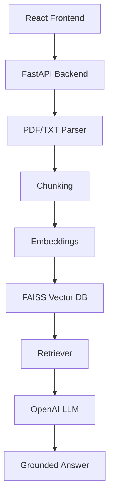

# Context-Aware Document Q&A Bot (RAG)

This is a Retrieval-Augmented Generation chatbot that lets users upload PDF or TXT documents and ask grounded questions about them. The system parses the document, chunks the extracted text, embeds the chunks, searches a FAISS vector index, and sends the best matches to OpenAI for a final answer.

## Overview

The application is designed to answer only from uploaded content. It returns source references, confidence scores, and highlighted retrieved chunks so users can verify where an answer came from.

## Features

- PDF/TXT upload
- Document parsing with page metadata
- Overlapping chunk generation
- Semantic search with embeddings and FAISS
- OpenAI-powered grounded answers
- ChatGPT-style chat UI
- Session conversation history
- Multiple uploaded documents with per-document sessions
- Source references and confidence scores
- Exact paragraph previews for explainability
- Cosine similarity retrieval with normalized embeddings
- Out-of-scope detection using similarity plus lexical overlap

## Architecture



## Tech Stack

Frontend:

- React
- TypeScript
- Axios

Backend:

- FastAPI
- Python

AI / Retrieval:

- Sentence Transformers
- FAISS
- OpenAI API
- PyMuPDF

## Chunking Strategy

The document is split into overlapping word chunks.

- Chunk size: 500 words
- Overlap: 100 words

This helps keep context continuity between neighboring chunks and improves retrieval quality.

## Retrieval Pipeline

1. Parse uploaded PDF or TXT into page-level text with page metadata.
2. Split text into overlapping chunks (500 words, 100-word overlap).
3. Generate embeddings using Sentence Transformers (all-MiniLM-L6-v2).
4. Normalize vectors and store in FAISS IndexFlatIP (cosine similarity).
5. Convert user questions into embeddings.
6. Retrieve top-k chunks using FAISS similarity search.
7. Apply dual-scoring: lexical overlap + semantic similarity.
8. Classify scope (in-scope/out-of-scope) using thresholds.
9. Send top retrieved context + matched paragraph to OpenAI.
10. Return grounded answer with sources, confidence, and scope info.

## API Endpoints

- `POST /upload` - upload PDF/TXT, parse it, chunk it, embed it, and index it
- `POST /ask` - ask a question about the uploaded document

## Environment Variables

Create `backend/.env` from `backend/.env.example` and set:

```env
OPENAI_API_KEY=your_api_key_here
OPENAI_MODEL=gpt-4o-mini
MIN_SIMILARITY_FOR_ANSWER=0.28
MIN_OVERLAP_FOR_ANSWER=0.15
```

You can also set the frontend API URL with:

```env
VITE_API_BASE_URL=http://127.0.0.1:8000
```

## Local Setup

Backend:

```bash
cd backend
copy .env.example .env
pip install -r requirements.txt
uvicorn app:app --reload
```

Frontend:

```bash
cd frontend
npm install
npm run dev
```

Open the frontend at `http://localhost:5173` and the backend docs at `http://127.0.0.1:8000/docs`.

## Deployment

Recommended production split:

- Frontend: Vercel
- Backend: Render

Render backend settings:

- Runtime: Python
- Build Command: `pip install -r requirements.txt`
- Start Command: `uvicorn app:app --host 0.0.0.0 --port 10000`
- Environment variable: `OPENAI_API_KEY`

Vercel frontend settings:

- Framework preset: Vite
- Environment variable: `VITE_API_BASE_URL=https://your-backend.onrender.com`

## Testing

Run the E2E test script to validate the system:

```bash
python e2e_test.py
```

This uploads a sample document and tests retrieval + Q&A on real content.

## Key Implementation Notes

- **Dual Scoring**: Combines semantic similarity (70%) + lexical overlap (30%) for robust retrieval
- **Fuzzy Matching**: Handles typos and synonym variations in questions
- **Table-of-Contents Detection**: Filters low-quality chunks (headings, page numbers)
- **Session Persistence**: SQLite database maintains chat history per session
- **Smart Banners**: Detects document theme (emotional, technical, academic) for context-aware UI

## Screenshots

Add final screenshots to the `screenshots/` folder for the GitHub README.

## Project Layout

- `backend/app.py` - API routes
- `backend/parser.py` - PDF/TXT parsing
- `backend/chunking.py` - chunk generation
- `backend/embeddings.py` - embeddings and FAISS index creation
- `backend/rag.py` - semantic retrieval
- `backend/llm.py` - OpenAI answer generation
- `frontend/src/components/` - chat UI components

## Future Improvements

- Multi-document sessions
- OCR for scanned PDFs
- Streaming responses
- Persistent vector storage
- Semantic reranking

## Common Issues

- `422 Unprocessable Entity` usually means the field name does not match. Use `file` in the upload form.
- `Please upload a document first` from `/ask` means the backend has not indexed a document in the current process.
- `LLM is not configured` means `OPENAI_API_KEY` is missing from `backend/.env`.
- If a clearly in-document question still falls back, check `MIN_SIMILARITY_FOR_ANSWER` and `MIN_OVERLAP_FOR_ANSWER` in `.env`.
